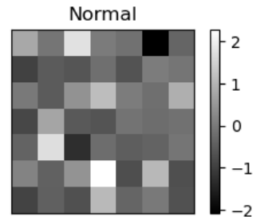

# Machine Learning

## [CNN Classification of blood cell types from microscopy ../Images](BCCD_CNN.py)

Convolutional neural networks to classify blood cells into 4 main types (eosinophils, neutrophils, monocytes and lymphocytes) from microscopy ../Images of blood tissue.

## [CNN cancer cell classification using gene expression profiles](CNN_Breast_Cancer.ipynb)

Convolutional neural networks for breast cancer type classification based on gene expression profiles.

## [Multilayer perceptron Fungal family classification](MLP-kfold_overSMOTE.Rmd)

Multilayer Perceptron for classifying fungi into 4 superfamilies based on gene expression profiles.