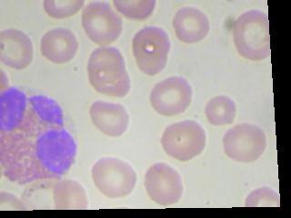
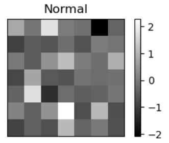
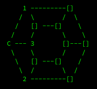
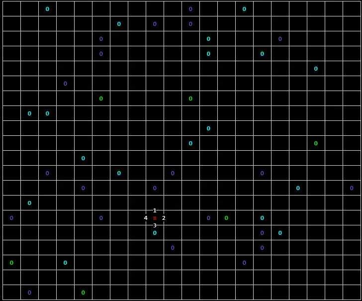

# Portfolio

## [Algorithmic](Algorithmic/AlgorithmiqueArbresGraphes.py)

Solving a problem consisting in determining the collision of balls in a space using the characteristics of a binary tree data structure.

## [SQL Database](SQL/TD_panda_SQL.py)

Design of a tool for automatic data integration into a SQL database, with an ergonomic Python interface for simplified database queries.

## [Machine Learning](Machine_Learning)

### [CNN Classification of blood cell types from microscopy images](Machine_Learning/BCCD_CNN.py)

Convolutional neural networks to classify blood cells into 4 main types (eosinophils, neutrophils, monocytes and lymphocytes) from microscopy images of blood tissue.

### [CNN cancer cell classification using gene expression profiles](Machine_Learning/CNN_Breast_Cancer.ipynb)

Convolutional neural networks for breast cancer type classification based on gene expression profiles.

### [Multilayer perceptron Fungal family classification](Machine_Learning/MLP-kfold_overSMOTE.Rmd)

Multilayer Perceptron for classifying fungi into 4 superfamilies based on gene expression profiles.

## [Omics](Omics)

Assembles reads from a FASTQ file in optimal sequence using 2 different algorithms, SCS (shortest common superstring) and Greedy. 
Consists of a library of functions [assembly.py](Omics/assembly.py) and a main [test_assembly.py](Omics/test_assembly.py). 

<!-- ## [Développement](Developpment)

### Python
#### [Wumpus](Developpement/wumpus.py)

### Java
#### [Virus](Developpement/Java%20Virus/)

 -->
